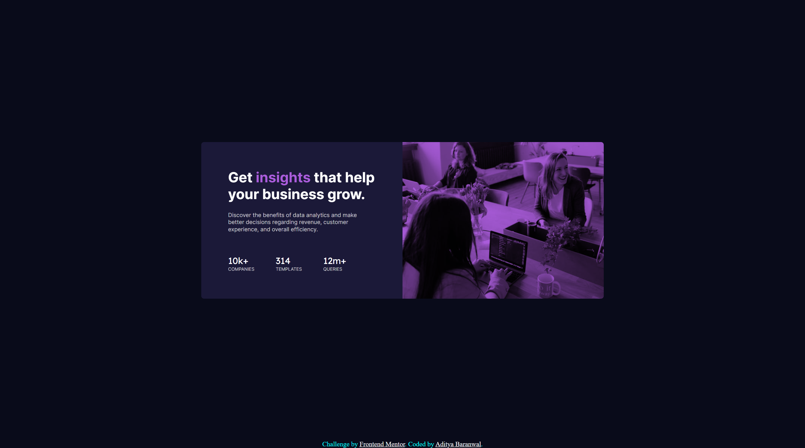

# Frontend Mentor - Stats preview card component solution

This is a solution to the [Stats preview card component challenge on Frontend Mentor](https://www.frontendmentor.io/challenges/stats-preview-card-component-8JqbgoU62). Frontend Mentor challenges help you improve your coding skills by building realistic projects. 

## Table of contents

- [Overview](#overview)
  - [The challenge](#the-challenge)
  - [Screenshot](#screenshot)
  - [Links](#links)
- [My process](#my-process)
  - [Built with](#built-with)
  - [What I learned](#what-i-learned)
  - [Continued development](#continued-development)
  - [Useful resources](#useful-resources)
- [Author](#author)
- [Acknowledgments](#acknowledgments)

## Overview

### The challenge

Users should be able to:

- View the optimal layout depending on their device's screen size

### Screenshot

.png)


### Links

- Solution URL: [get solution](https://github.com/CHARLIEADITYA/stats-preview-card-component-main.git)
- Live Site URL: [view](https://charlieaditya.github.io/stats-preview-card-component-main/)

## My process

### Built with

- Semantic HTML5 markup
- CSS custom properties
- Flexbox
- Mobile-first workflow

### What I learned
Here I learn lot of new thing and how to fix color on image. 

To see how you can add code snippets, see below:

```css
.image::after{
    width: 100%;
    height: 100%;
    position: absolute;
    content: '';
    background-color: hsla(277, 64%, 61%, 0.349);
    z-index: 1;
    background-blend-mode: multiply;
}

```
## Author

- Website - [github](https://github.com/CHARLIEADITYA)
- Frontend Mentor - [@CHARLIEADITYA](https://www.frontendmentor.io/profile/CHARLIEADITYA)
- Linkedin - [@adityabaranwal34](https://www.linkedin.com/in/adityabaranwal34/)


